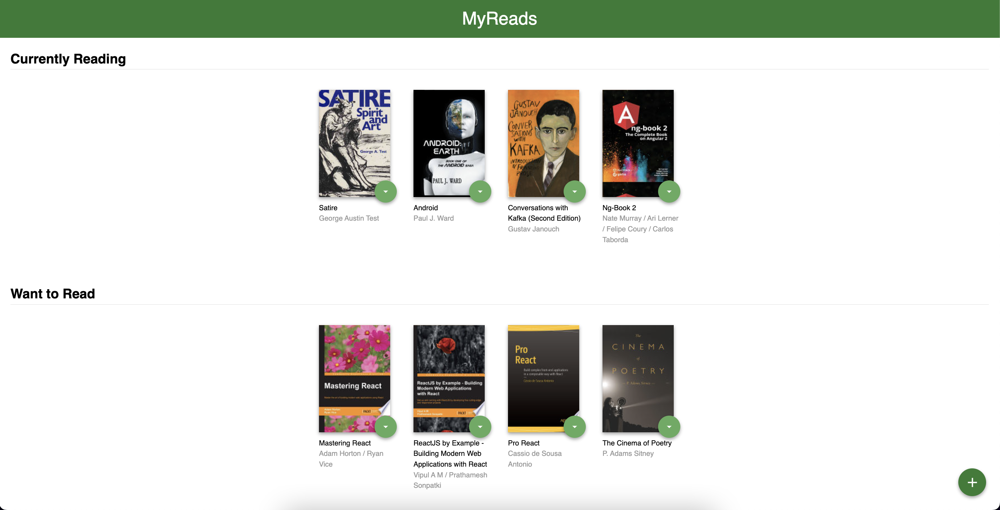

# Udacity Book Tracking App

This app lets you create a bookshelf that allows you to select and categorize books you have read, are
currently reading, or want to read.

## Installation

To get started developing right away with either yarn or npm:

- install all project dependencies with `npm install`
- start the development server with `npm start`

## What You're Getting

